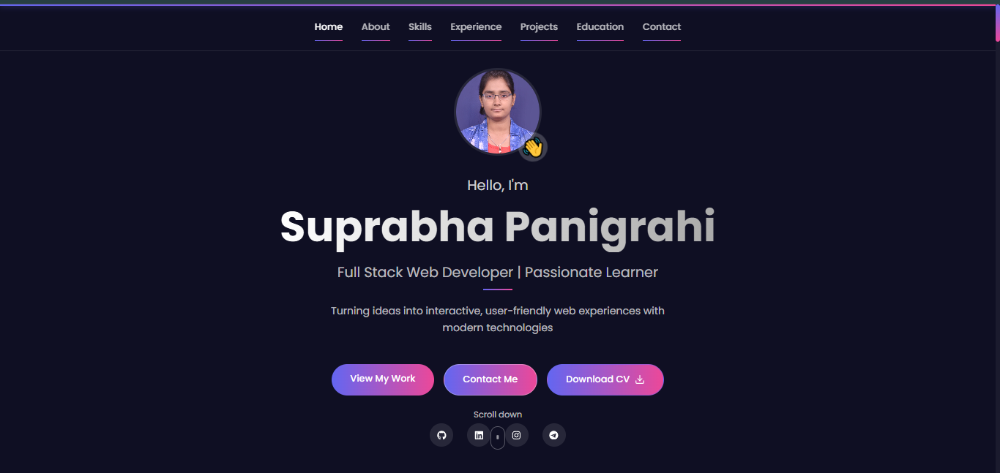

# 💼 Personal Portfolio Website

Welcome to my personal developer portfolio — built using **React.js**, this website showcases my skills, projects, and passion for creating exceptional digital experiences.

## 🧑‍💻 About Me

I’m an aspiring full-stack web developer with a strong foundation in **HTML**, **CSS**, **JavaScript**, **TypeScript**, and **Python**, and hands-on experience with modern technologies like **React**, **Next.js**, **Node.js**, **Express.js**, and **MongoDB**. I love building responsive, user-friendly, and impactful web applications that solve real-world problems.

---

## 🚀 Live Demo

🌐 [View Live Portfolio](https://your-portfolio-url.vercel.app)


---

## 🛠️ Tech Stack

- **Frontend**: React.js, HTML5, CSS3, JavaScript (ES6+), TypeScript
- **Styling**: CSS Modules, Framer Motion
- **Backend**: Node.js, Express.js
- **Database**: MongoDB
- **Version Control**: Git & GitHub
- **Deployment**: Vercel
- **Design Tool**: Figma

---

## ✨ Features

- ⚡ Responsive design (Mobile, Tablet, Desktop)
- 🎨 Clean and modern UI
- 🧩 Project filtering by category (Web, App, Fullstack, Design)
- 🎞️ Smooth animations with Framer Motion
- 🔗 Direct links to live projects and GitHub repositories
- 🧠 About Me, Skills, Education, and Contact sections

---

## 🖼️ Screenshots

  

---

## 📌 Getting Started Locally

To run this project locally on your machine:

### 1. Clone the Repository

```bash
git clone https://github.com/SuprabhaPanigrahi/Portfolio-Project-using-React
cd Portfolio-Project-using-React
npm install
npm start

```

📤 Deployment

This project is deployed using Vercel.

To deploy your own version:

Fork the repository

Push it to your GitHub

Connect it to Vercel

Deploy!

🙌 Acknowledgements

Framer Motion – UI animation library

Figma – for designing the UI layout

Vercel – seamless deployment

📫 Contact

Feel free to connect with me:

💼 LinkedIn - www.linkedin.com/in/suprabha-panigrahi 

📧  suprabhapanigrahi620@gmail.com  

💻 GitHub - https://github.com/SuprabhaPanigrahi 


Made with ❤️ and React by Suprabha Panigrahi